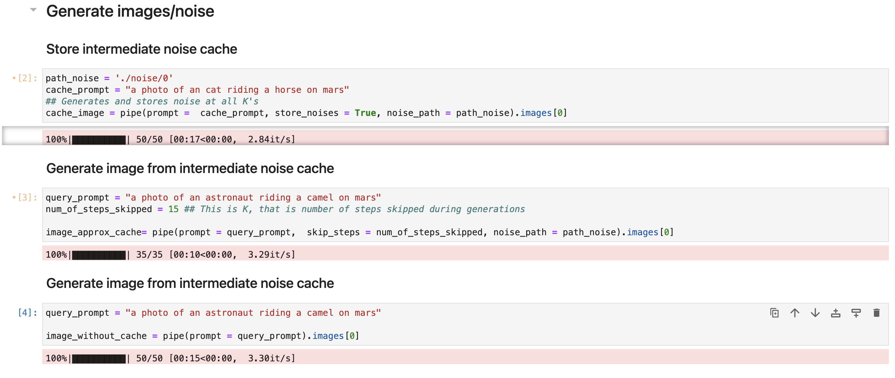

# AccuScale
### Paper \#38: Micro-managing Prompts for High-Throughput Text-to-Image Inference Serving
#### Under review at ATC 2024

## Directory Structure

1. **diffusers** - Modified Stable Diffusion XL pipeline in `diffusers/pipelines/stable_diffusion_xl`. The code was cloned from [Hugging Face Diffusers](https://github.com/huggingface/diffusers) and adapted to incorporate approximate caching. Lines modified/added for the caching process.

2. **noise** - Directory to store noises generated for image generation using approximate caching.

3. **pipeline** - Contains cache scripts and utilities, classifier scripts and utilities, cache_logs to display queries and their retrieved K values for a sample, along with a small set of examples with images, and a notebook to see the pipeline end-to-end. The `pipeline-system.ipynb` notebook is left empty for anonymous submission.

4. **generate_approx_cache.ipynb** - A notebook to generate noise and use it to generate images for query prompts using approximate caching.

5. **csv files** - Workload traces for Normal and Bursty cases.

6. **solver_milp_oda** - Sample pseudo-code for Distribution Aligner (ODA) and Allocation (MILP) solvers.

## Usage

For installing required dependecies, please use following:  
`
pip install torch==2.0.0
`,
`
pip install diffusers==0.21.2
`,
`
pip install transformers==4.26.1
`

### 1. Try Out Approximate Caching

Use the `generate_approx_caching.ipynb` notebook to:

1. Generate noise for any cache prompt at all K values.
2. Generate images for query prompts using the noise generated in step 1 at specified K values.
3. Render to see cached image (baseline GPTCache), image generated using approximate caching (proposed NIRVANA), and standard diffusion generation (baseline Vanilla).

 

<!-- style="border: 1px solid #000; border-radius: 5px;"> -->

This script uses the stable diffusion XL pipeline, which takes 15 seconds for Vanilla generation on an A10g GPU. We have modified the script in the `diffusers` library (`diffusers/pipelines/stable_diffusion_xl`) and provided a custom `diffusers` directory.
